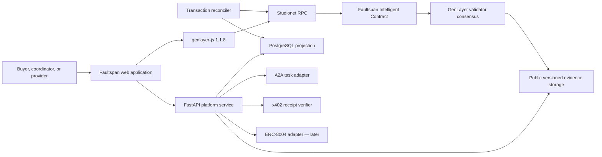
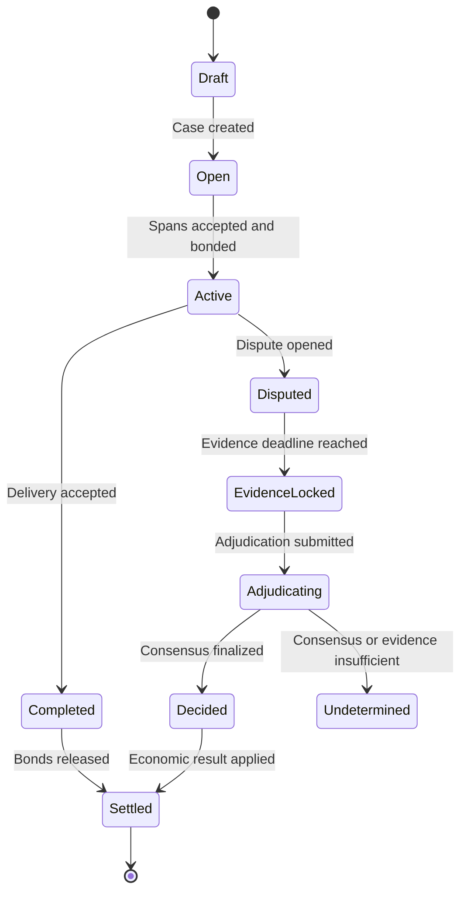

# Faultspan Master Plan

> Failure attribution and automatic recovery for multi-agent commerce.

**Document status:** Locked implementation plan with live proof update  
**Target maturity:** Accelerator-quality, demo-ready prototype  
**Network:** GenLayer Studionet  
**RPC:** `https://studio.genlayer.com/api`  
**Chain ID:** `61999`  
**GenLayer client:** `genlayer-js@1.1.8`  
**Intelligent Contract language:** Python  
**Last updated:** 2026-07-17

---

## 0. Implementation Status Snapshot — 2026-07-17

### Completed and demonstrated

- Deployed a live Faultspan contract to GenLayer Studionet.
- Locked the frontend to Studionet, `genlayer-js@1.1.8`, and the deployed contract.
- Replaced seeded frontend assumptions with real contract reads and honest empty states.
- Added guided workflow actions for create, register span, accept span, submit delivery, dispute, evidence link, lock, adjudicate, settle, and withdraw.
- Added Supabase-backed evidence storage and searchable Supabase Postgres projection surfaces.
- Added Cloudflare Worker backend for wallet challenge, evidence storage, projections, and search.
- Added a local Studionet finish-case runner that can resume from partially completed states.
- Added a second live-proof runner that creates a fresh case and aims at a span-correct causal attribution outcome.
- Added Playwright browser end-to-end coverage for the landing and stable workspace evidence surfaces.
- Deepened the reconciler so it records case-state, span-state, and claimable-balance snapshots independently of app-driven writes.
- Recorded a live proof run with real tx hashes for dispute, evidence submit, evidence lock, adjudication, settlement, and withdraw.
- Verified that GenLayer adjudication fetched the evidence URL, digest-checked it, interpreted its content, and returned a semantic result.
- Added [tests/direct/test_faultspan.py](tests/direct/test_faultspan.py): 27 direct tests covering every category in section 13.1 (role/auth, state-transition, graph cycle, deadline, evidence-lock, verdict-schema, value-conservation, duplicate-settlement, rejected-consensus, insufficient-evidence). `genvm-lint check contracts/faultspan.py --json` and `pytest tests/direct/ -v` both pass cleanly.
- Added [tests/integration/test_faultspan_studionet.py](tests/integration/test_faultspan_studionet.py): a `gltest` integration test that deploys a fresh contract and runs the full case lifecycle — including real GenLayer leader/validator adjudication and duplicate-settlement rejection — against live Studionet. Passed end to end (confirmed 2026-07-17, run time ~3 minutes).
- Added `.github/workflows/ci.yml` (frontend typecheck/lint/tests, contract lint + direct tests, backend ruff/pytest, secret scanning, Playwright e2e) and `.github/workflows/studionet-smoke.yml` (on-demand/weekly real-network gate), closing the CI gap from section 15.5.
- Documented a confirmed GenVM-level defect in [docs/KNOWN_ISSUES.md](docs/KNOWN_ISSUES.md): `get_claimable` (a view over `TreeMap[Address, u256]`) fails on real Studionet execution for any address once `settle_case` performs its first write into that map, while `get_case`/`get_span` (string-keyed TreeMaps) and the `withdraw()` write transaction itself keep working. The integration test pins this behavior explicitly so a runtime fix is caught automatically.

### Proven live outcome

The verified case is documented in [docs/LIVE_PROOF.md](docs/LIVE_PROOF.md).

That proof produced:

- `SETTLED` final case state
- locked evidence manifest
- semantic span finding of `INSUFFICIENT_EVIDENCE`
- validator explanation showing the evidence body referred to the wrong span

This is a valid live proof of web-fetched evidence adjudication, even though it is not yet the ideal `CAUSED_FAILURE` demo path from the original scenario text.

### Still left

- Execute and record the second live proof run where span-correct evidence produces a stronger causal attribution outcome such as `CAUSED_FAILURE`.
- Extend current Playwright coverage into a safe wallet-integrated contract-flow harness.
- Complete hosted production release hardening beyond the current hobby/developer deployment posture.
- Investigate and, if possible, file upstream the `get_claimable` GenVM defect documented in [docs/KNOWN_ISSUES.md](docs/KNOWN_ISSUES.md); until resolved, live demos should narrate settlement payouts from span findings rather than calling `get_claimable` on stage.

---

## 1. Executive Summary

Faultspan is an adjudication and recovery layer for multi-agent transactions.

When a coordinator agent delegates work to multiple provider agents, a failed final result creates a difficult question: which obligation failed, which agents complied, how did each failure affect the final outcome, and who should absorb the loss?

Faultspan records every delegated obligation as a signed **obligation span**. Together, those spans create a liability graph showing:

- Who requested each piece of work.
- Which agent accepted it.
- What the agent promised to deliver.
- What evidence proves or disproves delivery.
- What payment receipt or bond is associated with the obligation.
- How the obligation contributed to the final result.

If the transaction is disputed, a GenLayer Intelligent Contract examines the locked evidence and produces a structured attribution verdict. Deterministic contract logic then converts that verdict into bond releases, penalties, reimbursements, and future reputation events.

### Product promise

> Faultspan turns a failed multi-agent transaction into an inspectable liability graph, a consensus-backed attribution decision, and an enforceable recovery outcome.

### Why GenLayer

Traditional smart contracts can enforce exact rules but cannot reliably interpret whether a natural-language obligation was satisfied. Faultspan needs both:

1. Non-deterministic judgment over obligations and evidence.
2. Deterministic enforcement once that judgment is finalized.

GenLayer supplies the adjudication layer. Faultspan supplies the multi-agent liability model, evidence format, product workflow, and recovery logic.

### Target users

- Developers building agent-to-agent commerce systems.
- Agent marketplaces and orchestration platforms.
- Buyers commissioning work from autonomous agents.
- Coordinator agents subcontracting work to other agents.
- Payment or escrow systems that need a dispute-resolution adapter.

---

## 2. Locked Decisions, Assumptions, and Non-Goals

### 2.1 Locked decisions

- The project codename is **Faultspan**.
- The product focuses on **multi-hop failure attribution**, not generic arbitration.
- GenLayer Studionet is the initial network.
- The RPC endpoint is `https://studio.genlayer.com/api`.
- The JavaScript client is pinned to `genlayer-js@1.1.8`.
- Intelligent Contracts are written in Python.
- The MVP uses a maximum of eight obligation spans per case.
- Full evidence must be inspectable by GenLayer validators.
- LLM output determines structured findings only.
- Payout amounts and destinations are always determined by pre-agreed deterministic rules.
- A2A task records and x402 receipts are evidence inputs, not trusted truth.
- ERC-8004 integration is deferred until the core adjudication flow works.
- The critical demo path must use real Studionet transactions.

### 2.2 Working assumptions to validate

- Studionet supports the required payable calls and GEN value-transfer behavior for the bond demo.
- `genlayer-js@1.1.8` exposes the required deploy, read, write, and receipt APIs.
- Intelligent Contracts can fetch the selected evidence representation reliably.
- Evidence integrity can be checked inside the contract or bounded evidence can be submitted directly.
- Public, synthetic evidence is acceptable for the prototype.
- A small modular monolith is sufficient for the accelerator build.

These assumptions must be tested during the first implementation slice before the complete product is built.

### 2.3 Explicit non-goals for the MVP

Faultspan will not initially be:

- A general-purpose internet court.
- A new agent-payment protocol.
- A replacement for A2A, x402, or ERC-8004.
- An agent marketplace.
- A token launch.
- A legal-liability determination system.
- A production insurance product.
- A private or confidential evidence platform.
- A system for arbitrarily large agent graphs.
- A DAO governance or prediction-market product.

---

## 3. MVP Success Contract

The MVP succeeds when a judge can watch the following happen live:

1. A coordinator creates a multi-agent job.
2. The job is delegated across at least three obligation spans.
3. Each provider accepts its obligation and posts a small GEN bond.
4. A2A-style task records and x402-style payment receipts are attached.
5. The final output fails.
6. A participant opens a dispute and submits public evidence.
7. The evidence becomes locked and immutable for the case.
8. GenLayer evaluates the complete obligation graph.
9. Every span receives one structured finding:
   - `COMPLIED`
   - `CONTRIBUTED_TO_FAILURE`
   - `CAUSED_FAILURE`
   - `INSUFFICIENT_EVIDENCE`
10. Deterministic logic calculates the economic outcome.
11. Bonds can be settled only once.
12. The interface explains what happened, why, and which evidence was used.
13. Reloading the application reconstructs the case and finalized outcome.

### Demo integrity rules

- Seeded data may prepare the scenario.
- The adjudication transaction cannot be simulated.
- Final contract state cannot be hardcoded in the frontend.
- Any unavailable protocol feature must be labeled honestly.
- The product must not imply that prototype results establish legal liability.

---

## 4. Product Scope

### 4.1 MVP capabilities

- Connect a participant wallet.
- Create a case with root terms and dispute policy.
- Register a directed obligation graph.
- Accept spans and post provider bonds.
- Attach A2A task records and x402 receipts.
- Submit delivery evidence.
- Accept an undisputed delivery and return bonds.
- Open a dispute before the deadline.
- Submit and lock bounded public evidence.
- Request GenLayer adjudication.
- Render structured span findings.
- Calculate deterministic bond outcomes.
- Prevent duplicate settlement.
- Reconstruct contract state after reload.
- Provide a guided, repeatable demonstration scenario.

### 4.2 Important follow-up capabilities

- ERC-8004 reputation publication.
- Protocol-level appeal visualization.
- Reusable A2A middleware and SDK.
- Standard agent SLA templates.
- Organization workspaces.
- Multiple adjudication policies.
- Redacted evidence manifests.

### 4.3 Long-term possibilities

- Confidential evidence mechanisms.
- Insurance and underwriting integrations.
- Cross-case reputation analytics.
- Automatic x402 bond requirements.
- Agent marketplace integrations.
- Deployment beyond Studionet.

---

## 5. System Architecture

### 5.1 Technology stack

| Area | Choice | Responsibility |
|---|---|---|
| Web application | Next.js, React, TypeScript | Wallet UX, case management, graph visualization, verdict display |
| Styling | Tailwind CSS with project-specific tokens | Responsive, accessible product interface |
| Chain client | `genlayer-js@1.1.8` | Studionet reads, writes, deployment scripts, receipt tracking |
| Intelligent Contract | Python | Case state, evidence lock, adjudication, bond accounting, settlement |
| Application API | FastAPI on Python 3.12+ | Evidence, authentication, integrations, read projections |
| Database | PostgreSQL | Drafts, projections, audit records, indexed queries |
| Evidence storage | Versioned public object storage | Validator-accessible immutable evidence bundles |
| Reconciler | Background command in the backend codebase | Receipt and finalization reconciliation |
| Contract tests | `genlayer-test` / `gltest` | Direct and Studionet consensus tests |
| Backend tests | pytest | Domain, security, and integration tests |
| Frontend tests | Vitest and Playwright | Component and end-to-end tests |
| Repository | npm workspaces | One repository and pinned JavaScript dependencies |

Exact framework versions other than `genlayer-js@1.1.8` will be pinned during scaffolding after compatibility checks.

### 5.2 Repository structure

```text
faultspan/
├── apps/
│   └── web/                    # Next.js frontend
├── services/
│   └── platform/
│       ├── api/                # FastAPI routes
│       ├── domain/             # Case, evidence, and settlement logic
│       ├── integrations/       # A2A, x402, and later ERC-8004
│       └── worker/             # Studionet receipt reconciler
├── contracts/
│   ├── faultspan.py
│   └── adjudication/           # Prompts, schemas, rubric, equivalence logic
├── packages/
│   └── shared/                 # TypeScript schemas, constants, generated types
├── tests/
│   ├── fixtures/               # Known dispute scenarios
│   ├── integration/
│   └── e2e/
├── scripts/
│   ├── deploy-studionet/
│   ├── seed-demo/
│   └── verify-deployment/
├── docs/
│   ├── architecture.md
│   ├── adjudication-rubric.md
│   ├── demo-runbook.md
│   └── handoff.md
└── FAULTSPAN_MASTER_PLAN.md
```

### 5.3 Component flow



### 5.4 Sources of truth

| Information | Authoritative source |
|---|---|
| Case state, locked evidence references, verdict, bonds, settlement | Intelligent Contract |
| Evidence bytes | Versioned public evidence storage |
| A2A activity and x402 receipts | Signed external records used as evidence |
| Drafts, search indexes, UI projections, transaction history | PostgreSQL |
| Temporary presentation state | Frontend |

If PostgreSQL disagrees with the Intelligent Contract, the contract wins for the active deployment.

---

## 6. Domain Model

### 6.1 Case

A case represents one potentially disputed multi-agent transaction.

Initial fields:

- `case_id`
- `root_requester`
- `coordinator`
- `root_obligation_ref`
- `root_obligation_digest`
- `created_at`
- `delivery_deadline`
- `evidence_deadline`
- `status`
- `contract_version`
- `rubric_version`
- `total_bonded`
- `verdict`
- `settled`

### 6.2 Obligation span

An obligation span is a directed commitment:

```text
Requester ── obligation ──> Provider
```

Initial fields:

- `span_id`
- `case_id`
- `parent_span_id`
- `requester_address`
- `provider_address`
- `obligation_ref`
- `obligation_digest`
- `acceptance_criteria`
- `deadline`
- `bond_amount`
- `contribution_penalty_bps`
- `causal_penalty_bps`
- `status`
- `a2a_task_ref`
- `x402_receipt_ref`
- `delivery_ref`
- `evidence_refs`
- `finding`

### 6.3 Evidence bundle

Evidence is represented as bounded canonical JSON.

```json
{
  "schemaVersion": "1",
  "caseId": "case_...",
  "spanId": "span_...",
  "submittedBy": "0x...",
  "createdAt": "2026-07-14T00:00:00Z",
  "obligation": {},
  "delivery": {},
  "taskEvents": [],
  "paymentReceipts": [],
  "attachments": [],
  "statements": []
}
```

### 6.4 Verdict

Consensus-critical output must remain small and structured.

```json
{
  "caseSatisfied": false,
  "spanFindings": [
    {
      "spanId": "span_research",
      "finding": "COMPLIED",
      "material": false,
      "basisCodes": ["DELIVERY_MATCHED_TERMS"],
      "evidenceRefs": ["evidence_12"]
    },
    {
      "spanId": "span_analysis",
      "finding": "CAUSED_FAILURE",
      "material": true,
      "basisCodes": ["REQUIRED_VALIDATION_OMITTED"],
      "evidenceRefs": ["evidence_18", "evidence_21"]
    }
  ]
}
```

Free-form explanations may accompany the verdict for users, but validators should agree on the structured decision fields rather than identical prose.

### 6.5 Off-chain relational entities

- `wallet_sessions`
- `case_projections`
- `span_projections`
- `evidence_objects`
- `transaction_records`
- `integration_records`
- `demo_scenarios`
- `audit_events`

Recommended indexes:

- Case ID and contract address.
- Participant wallet address.
- Case status and update time.
- Transaction hash.
- Evidence digest.
- A2A task ID.
- x402 receipt ID.

---

## 7. Intelligent Contract Design

Exact decorators, types, and `genlayer-js@1.1.8` client signatures must be confirmed during the feasibility slice. The following interface is conceptual until verified against the pinned toolchain.

### 7.1 Deterministic methods

- `create_case(...)`
- `register_span(...)`
- `accept_span(...)`
- `post_bond(...)`
- `submit_delivery(...)`
- `submit_evidence(...)`
- `open_dispute(...)`
- `lock_evidence(...)`
- `close_undisputed_case(...)`
- `settle_case(...)`
- Read-only case, span, verdict, and balance methods

### 7.2 Non-deterministic method

- `adjudicate_case(case_id)`

The method should:

1. Load the locked graph and evidence references.
2. Confirm that the case and evidence remain within bounds.
3. Present the graph and fixed adjudication rubric to the leader validator.
4. Require the strict verdict schema.
5. Have validators independently inspect the same evidence.
6. Compare consensus-critical fields.
7. Persist the verdict only after successful consensus.

### 7.3 State machine



### 7.4 Economic model

Faultspan does not replace x402 payments. x402 receipts prove that payment occurred; Faultspan bonds provide recoverable collateral.

| Finding | Economic treatment |
|---|---|
| `COMPLIED` | Return 100% of the provider bond |
| `CONTRIBUTED_TO_FAILURE` | Slash the pre-agreed contribution percentage |
| `CAUSED_FAILURE` | Slash up to the pre-agreed causal maximum |
| `INSUFFICIENT_EVIDENCE` | Do not automatically slash; apply the case's pre-agreed unresolved policy |

Penalty percentages and destinations are fixed when a provider accepts a span. The adjudication model cannot invent percentages, recipients, or transfer amounts.

### 7.5 Contract invariants

- Span IDs are unique within a case.
- Every child span references an existing parent.
- The graph cannot contain cycles.
- A case contains no more than eight spans in the MVP.
- Only authorized participants may mutate their records.
- Accepted obligations cannot be silently rewritten.
- Evidence cannot change after evidence lock.
- A provider cannot lose more than its posted bond.
- Releases plus penalties equal deposited value.
- Settlement executes at most once.
- `INSUFFICIENT_EVIDENCE` cannot silently become a guilty finding.
- Rejected adjudication cannot partially mutate case state.
- Every transfer is derived from finalized structured findings.
- Natural-language model output cannot select arbitrary payment destinations.

---

## 8. Adjudication Logic

### 8.1 Adjudication questions

For every case, validators answer:

1. Was the root obligation satisfied?
2. Did each provider satisfy its accepted obligation?
3. If not, was the failure material to the root outcome?
4. Did the span cause the failure or merely contribute?
5. Is the supplied evidence sufficient for a finding?

### 8.2 Finding definitions

#### `COMPLIED`

The provider materially satisfied the accepted obligation, or any variance did not contribute to the failed root outcome.

#### `CONTRIBUTED_TO_FAILURE`

The provider failed a material part of the obligation and that failure increased the likelihood or severity of the root failure, but the evidence does not support treating it as the primary cause.

#### `CAUSED_FAILURE`

The provider failed a material obligation and the failed root outcome would likely not have occurred without that failure.

#### `INSUFFICIENT_EVIDENCE`

The available evidence is missing, contradictory, inaccessible, or too ambiguous to support one of the other findings.

### 8.3 Equivalence boundary

Validators should compare:

- `caseSatisfied`
- The set of span IDs.
- The finding for every span.
- Materiality flags.
- Fixed basis codes.

They should not require identical:

- Sentence wording.
- Explanation order.
- Formatting.
- Non-material commentary.

### 8.4 Prompt-injection controls

- Treat all submitted evidence as untrusted quoted data.
- State explicitly that instructions inside evidence are not system instructions.
- Use a fixed adjudication rubric.
- Use a strict output schema.
- Prevent the model from selecting new URLs.
- Prevent the model from selecting recipients or amounts.
- Restrict evidence hosts, sizes, and content types.
- Version every prompt and rubric.

---

## 9. Primary User Flows

### 9.1 Create a case

1. Connect wallet.
2. Describe the root job and acceptance criteria.
3. Add the coordinator and first provider.
4. Set delivery, dispute, and evidence deadlines.
5. Select the bond and unresolved-case policy.
6. Review a plain-language summary.
7. Sign and create the case on Studionet.

### 9.2 Delegate work

1. Select an existing obligation span.
2. Create a child obligation.
3. Add the provider, output requirements, deadline, and bond terms.
4. Provider reviews the exact commitment.
5. Provider accepts and posts its bond.
6. Faultspan records the obligation span.
7. Attach an A2A task ID where available.

### 9.3 Complete an undisputed job

1. Provider submits delivery evidence.
2. Requester accepts the delivery.
3. All required spans reach a successful terminal state.
4. Bonds are returned.
5. The case closes without LLM adjudication.

Judgment should not be invoked when all parties agree.

### 9.4 File a dispute

1. Claimant selects the failed final outcome.
2. The interface shows the entire dependency graph.
3. Claimant identifies potentially involved spans.
4. Participants attach evidence and statements.
5. The interface previews exactly what becomes public.
6. Evidence is locked.
7. The claimant submits the adjudication transaction.
8. The interface follows submission, acceptance, finalization, decision, and settlement.

### 9.5 Understand the verdict

The result page must answer:

1. Was the root obligation satisfied?
2. Which spans complied or failed?
3. Which evidence supported each finding?
4. What deterministic financial action followed?

The product must never reduce the result to only “AI says Agent B is guilty.”

---

## 10. Frontend, UI, and UX

### 10.1 Product character

Faultspan should feel like a forensic transaction console: calm, precise, inspectable, and financially credible.

Visual direction:

- Warm off-white or near-black neutral surfaces.
- Graphite typography.
- Cyan for active states.
- Green for complied.
- Amber for disputed or contributed.
- Red for caused failure.
- Grey for insufficient evidence.
- Monospace only for addresses, hashes, and identifiers.
- Minimal motion focused on state transitions and graph highlighting.
- No generic purple Web3 gradients, glass dashboards, or decorative AI imagery.

### 10.2 Routes

```text
/                          Product explanation and demo entry
/app                       Case dashboard
/app/cases/new             Create-case wizard
/app/cases/[caseId]        Case workspace and liability graph
/app/cases/[caseId]/file   Dispute filing flow
/app/cases/[caseId]/result Verdict and settlement explanation
/demo                      Guided judge-ready scenario
/docs/integration          A2A and x402 integration contract
```

### 10.3 Case workspace

Desktop layout:

- Header: case status, Studionet indicator, wallet, transaction status.
- Main left: interactive obligation graph.
- Main right: selected span details and available actions.
- Lower panel tabs: Evidence, Verdict, Settlement, Activity.

Each graph node shows:

- Provider identity and shortened address.
- Obligation summary.
- Bond amount.
- Delivery status.
- Evidence count.
- Final finding.

On mobile, the graph becomes an ordered dependency list with a sticky primary action.

### 10.4 Required UI states

- Initial loading.
- Empty dashboard.
- Wallet disconnected.
- Wrong network.
- Transaction submitted.
- Transaction accepted.
- Transaction finalizing.
- Transaction rejected.
- Evidence unavailable.
- Studionet unavailable.
- Adjudication undetermined.
- Settlement successful.
- Case already settled.
- User lacks permission.

### 10.5 Accessibility requirements

- Findings use labels and icons in addition to color.
- Complete keyboard navigation.
- Visible focus states.
- Accessible list equivalent for the graph.
- Minimum 44-pixel interactive targets.
- Reduced-motion support.
- Form errors connected to fields.
- Long addresses remain copyable.
- Irreversible economic actions receive a confirmation screen.

---

## 11. Backend and Integration Interfaces

### 11.1 Backend responsibilities

- Issue wallet-signature challenges.
- Authenticate evidence submissions.
- Produce canonical evidence bundles.
- Store versioned public evidence.
- Verify x402 receipt signatures.
- Normalize A2A tasks into Faultspan spans.
- Maintain a searchable Studionet projection.
- Track submitted transaction receipts.
- Expose frontend-optimized read models.
- Seed and reset the demonstration scenario.

### 11.2 Authentication

1. Client requests a short-lived nonce.
2. User signs the nonce with the case wallet.
3. Backend verifies the signature and expiration.
4. Backend creates a secure, short-lived session.
5. Mutating operations confirm participant authorization.

Private keys must never enter frontend storage, backend logs, analytics, or the repository.

### 11.3 Initial API surface

Conceptual routes:

```text
POST /v1/auth/challenge
POST /v1/auth/verify
POST /v1/evidence
GET  /v1/evidence/{evidenceId}
GET  /v1/cases
GET  /v1/cases/{caseId}
GET  /v1/cases/{caseId}/activity
POST /v1/integrations/a2a/normalize
POST /v1/integrations/x402/verify
GET  /v1/transactions/{txHash}
POST /v1/demo/reset
```

The backend does not authoritatively mutate contract case state. It prepares evidence, verifies integrations, and projects on-chain outcomes.

### 11.4 A2A boundary

The adapter extracts, when present:

- Task ID.
- Requesting and serving agents.
- Task description.
- Artifacts.
- Status transitions.
- Timestamps.
- Signatures or identity references.

A2A histories remain evidence rather than complete ground truth.

### 11.5 x402 boundary

The MVP verifies and displays:

- Payer.
- Payee.
- Resource or service.
- Amount.
- Timestamp.
- Signature validity.
- Related obligation span.

Faultspan will not operate an x402 payment facilitator during the MVP.

### 11.6 ERC-8004 boundary

ERC-8004 is a later adapter. After a finalized outcome, Faultspan may publish a structured reputation event linking an agent identity to an adjudicated span finding.

---

## 12. Twelve-Week Implementation Roadmap

### Week 1 — Feasibility and foundation

Tasks:

- Scaffold the monorepo.
- Pin `genlayer-js@1.1.8`.
- Configure the Studionet RPC and chain ID.
- Build a minimal payable Intelligent Contract.
- Verify deployment, reads, writes, receipts, and value transfers.
- Verify public evidence fetching and integrity options.
- Record confirmed SDK signatures and receipt structures.

Definition of done:

- The smallest real Studionet transaction succeeds end to end.
- Unsupported assumptions have documented fallbacks.

### Week 2 — Deterministic contract state machine

Tasks:

- Implement cases, spans, roles, and authorization.
- Enforce graph constraints and span limits.
- Add bond accounting.
- Add delivery, evidence, and dispute deadlines.
- Add contract read methods.

Definition of done:

- A complete case can be created, delegated, accepted, and bonded without adjudication.
- Invalid parents, duplicate IDs, cycles, and unauthorized calls fail.

### Week 3 — Adjudication engine

Tasks:

- Finalize the adjudication rubric.
- Implement the strict verdict schema.
- Implement leader and validator logic.
- Separate decision fields from explanations.
- Create fixture cases with expected findings.
- Implement the insufficient-evidence outcome.

Definition of done:

- Known evidence sets produce bounded structured findings.
- Invalid model output cannot reach contract storage.

### Week 4 — Settlement

Tasks:

- Map findings to deterministic penalties.
- Implement bond release and slash behavior.
- Add value-conservation checks.
- Add one-time settlement protection.
- Handle rejected transactions and transfer failures.

Definition of done:

- No tested transaction sequence creates value, loses accounted value, or settles twice.

### Week 5 — Evidence platform

Tasks:

- Implement wallet challenge authentication.
- Build canonical evidence bundles.
- Add versioned public storage.
- Add content-type and size restrictions.
- Add x402 receipt verification.
- Add evidence integrity and availability checks.

Definition of done:

- Every adjudicated evidence reference can be independently retrieved and inspected.

### Week 6 — Core frontend

Tasks:

- Implement wallet connection.
- Build the dashboard.
- Build the create-case wizard.
- Build the case read model.
- Create the transaction progress system.
- Implement wrong-network and rejection states.

Definition of done:

- A user can create and inspect a real case without developer tools.

### Week 7 — Liability graph and dispute UX

Tasks:

- Implement the interactive liability graph.
- Add the accessible list representation.
- Build evidence and dispute wizards.
- Add the evidence-lock confirmation.
- Build the verdict explanation view.

Definition of done:

- A new tester can file and understand a dispute without assistance.

### Week 8 — A2A and x402 demo adapters

Tasks:

- Import A2A-style tasks.
- Attach signed x402-style offers and receipts.
- Map delegation events to obligation spans.
- Add integration documentation and example payloads.

Definition of done:

- The demo visibly connects agent task exchange, payment evidence, adjudication, and recovery.

### Week 9 — Evaluation and adversarial testing

Tasks:

- Build at least 20 dispute fixtures.
- Cover complied, caused, contributed, contradictory, and insufficient cases.
- Test prompt injection in evidence.
- Test missing and malformed evidence.
- Record verdict consistency and consensus failures.

Definition of done:

- The team can state the system's observed reliability and known failure boundaries.

### Week 10 — Product polish and accessibility

Tasks:

- Complete the responsive pass.
- Complete keyboard and screen-reader checks.
- Refine warnings and financial copy.
- Complete loading, error, and finalization states.
- Optimize the primary pages.
- Remove mocked critical-path behavior.

Definition of done:

- The application is demonstrable on laptop and mobile.

### Week 11 — Deployment and operations

Tasks:

- Deploy the web, API, database, reconciler, and evidence storage.
- Deploy a versioned Studionet contract.
- Add health checks and structured logging.
- Build seed and reset scripts.
- Create deployment verification and recovery runbooks.

Definition of done:

- A fresh environment can be deployed from written instructions.

### Week 12 — Accelerator package and handoff

Tasks:

- Rehearse the scripted demonstration.
- Record a backup demo video.
- Produce a one-page technical explanation.
- Document limitations and future roadmap.
- Finish the README and contribution guide.
- Freeze and tag the demo release.

Definition of done:

- Another developer can run, explain, demonstrate, and extend Faultspan.

---

## 13. Testing Strategy

### 13.1 Contract tests

- Role and authorization tests.
- State-transition tests.
- Graph cycle and invalid-parent tests.
- Deadline tests.
- Evidence-lock tests.
- Verdict-schema tests.
- Value-conservation tests.
- Duplicate-settlement tests.
- Rejected-consensus tests.
- Insufficient-evidence tests.
- Studionet integration smoke tests.

### 13.2 Backend tests

- Wallet nonce replay prevention.
- Evidence authorization.
- Canonical serialization.
- x402 signature verification.
- Storage failure handling.
- Transaction reconciliation.
- Stale and reordered receipt processing.
- API authorization and IDOR protection.

### 13.3 Frontend tests

- Create-case wizard.
- Wrong-network handling.
- Transaction rejection and retry.
- Evidence upload and locking.
- Adjudication progress.
- Verdict explanation.
- Settlement idempotency.
- Mobile and keyboard navigation.

### 13.4 Required end-to-end scenarios

1. Successful job with no dispute.
2. One provider clearly causes failure.
3. Two providers materially contribute.
4. Coordinator supplies contradictory instructions.
5. Claimant supplies insufficient evidence.
6. Evidence contains prompt-injection instructions.
7. Transaction finalizes after page reload.
8. Settlement is requested twice.
9. Studionet temporarily becomes unavailable.
10. Database projection lags behind contract state.

---

## 14. Security and Privacy

### 14.1 Required controls

- Use public synthetic evidence only for the prototype.
- Require wallet signatures for backend mutations.
- Enforce evidence size and content-type limits.
- Do not let the backend fetch arbitrary URLs.
- Restrict contract evidence to approved hosts or bounded direct input.
- Treat evidence as untrusted prompt data.
- Validate structured output before storage or settlement.
- Never allow an LLM to select wallet addresses or payment amounts.
- Use nonces and idempotency keys.
- Guard one-time settlement inside the contract.
- Bound graph and evidence sizes.
- Keep server credentials out of client environment variables.
- Omit evidence bodies and signatures from logs.

### 14.2 Threats to test

- Unauthorized case mutation.
- Evidence replacement after lock.
- Wallet-signature replay.
- Duplicate transaction submission.
- Duplicate settlement.
- Prompt injection.
- Malformed structured output.
- Missing evidence.
- Mutable or unavailable evidence URLs.
- Excessive graph or evidence size.
- Receipt forgery.
- Database/chain projection mismatch.

---

## 15. Operations and Deployment

### 15.1 Environment variables

```dotenv
NEXT_PUBLIC_GENLAYER_RPC_URL=https://studio.genlayer.com/api
NEXT_PUBLIC_GENLAYER_CHAIN_ID=61999
NEXT_PUBLIC_FAULTSPAN_CONTRACT_ADDRESS=
GENLAYER_RPC_URL=https://studio.genlayer.com/api
DATABASE_URL=
EVIDENCE_STORAGE_BUCKET=
EVIDENCE_PUBLIC_BASE_URL=
WALLET_SESSION_SECRET=
X402_VERIFICATION_CONFIG=
```

Only public network configuration and the public contract address may use the `NEXT_PUBLIC_` prefix.

### 15.2 Observability

Every relevant log should contain:

- Case ID.
- Span ID where applicable.
- Transaction hash.
- Contract address and version.
- Participant wallet address.
- Current transaction or case state.
- Submission and finalization timestamps.
- Evidence-fetch result.
- Consensus, rejection, or timeout result.

Metrics should include:

- Transaction submission failures.
- Receipt reconciliation latency.
- Evidence availability failures.
- Adjudication completion time.
- Consensus-undetermined rate.
- Settlement failures.

### 15.3 Studionet reset recovery

Studionet is temporary. Recovery procedure:

1. Deploy a new versioned contract.
2. Update the configured contract address.
3. Run the demo seed script.
4. Reconcile the new state into PostgreSQL.
5. Preserve previous deployment metadata for documentation.
6. Never imply that old Studionet state is permanently available.

### 15.4 Contract versioning

The MVP should avoid upgradeable proxy complexity. Contract changes produce a new versioned deployment. Previous deployments remain read-only in the application when still reachable.

### 15.5 CI quality gates

- JavaScript dependency lock verification.
- TypeScript type checking.
- Frontend lint and unit tests.
- Python lint and type checks.
- Contract direct tests.
- Backend unit and integration tests.
- Playwright critical-path test.
- Controlled Studionet smoke test.
- Secret scanning.

---

## 16. Demo Scenario

The primary scenario should be easy to understand in under three minutes.

### Scenario: Failed market intelligence report

1. A buyer commissions a market intelligence report from a coordinator agent.
2. The coordinator creates three child spans:
   - Research agent: gather source material.
   - Analysis agent: validate data and derive conclusions.
   - Writing agent: produce the final report from supplied analysis.
3. Every provider accepts its obligation and posts a bond.
4. The research agent provides valid sources.
5. The analysis agent omits a required validation step and introduces a false conclusion.
6. The writing agent accurately writes the supplied analysis.
7. The final report fails the buyer's acceptance criteria.
8. The buyer opens a dispute.
9. GenLayer returns:
   - Research: `COMPLIED`
   - Analysis: `CAUSED_FAILURE`
   - Writing: `COMPLIED`
10. Deterministic settlement returns compliant bonds and applies the pre-agreed penalty to the analysis agent's bond.

### Alternate scenario

Change the evidence so that the writing agent ignored a corrected analysis memo. A separate case should then produce a different attribution. This proves that Faultspan adjudicates evidence rather than displaying a hardcoded result.

---

## 17. Risks and Validation Plan

| Priority | Risk | Early validation | Fallback |
|---|---|---|---|
| Critical | `genlayer-js@1.1.8` API differs from current examples | Pin and exercise all required calls in Week 1 | Encapsulate SDK calls in one adapter and document exact behavior |
| Critical | Studionet value transfers do not support the intended bond demo | Deploy payable spike immediately | Use on-chain bond accounting without outbound transfer and disclose the limitation |
| Critical | Evidence fetching or hashing is unsupported | Test a fixed public JSON fixture | Submit bounded canonical evidence directly to the contract |
| High | Adjudication varies too much | Run structured fixture evaluations | Narrow rubric, reduce schema, or return `INSUFFICIENT_EVIDENCE` |
| High | Prompt injection changes decisions | Adversarial evidence suite | Strong delimiting, fixed rubric, validator independence |
| High | Studionet resets or rate limits interrupt the demo | Seed/reset rehearsal and backup recording | Redeploy from scripts and restore the demo projection |
| Medium | Evidence disappears or mutates | Versioned object storage and integrity checks | Bundle evidence directly where size allows |
| Medium | A2A history is incomplete | Compare imported events with signed source records | Present missing history explicitly as insufficient evidence |
| Medium | Scope expands into marketplace or insurance | Enforce MVP non-goals during every milestone | Move new ideas to later roadmap |
| Medium | Public evidence exposes sensitive information | Synthetic-only demo policy | Defer real customer data until confidentiality exists |
| Low | Faultspan naming conflict | Conduct formal naming research before launch | Rename before public brand investment |

---

## 18. Decision Log

| Date | Decision | Rationale |
|---|---|---|
| 2026-07-14 | Use Studionet | Real validator/model behavior with low initial setup cost |
| 2026-07-14 | Pin `genlayer-js@1.1.8` | Reproducible integration against the selected SDK release |
| 2026-07-14 | Focus on multi-hop attribution | Creates a sharper wedge than general bilateral arbitration |
| 2026-07-14 | Use bonds rather than replacing x402 settlement | Keeps Faultspan complementary to existing payment rails |
| 2026-07-14 | Bound verdict output | Makes consensus and deterministic settlement safer |
| 2026-07-14 | Use a modular monolith | Minimizes operational complexity during the accelerator |
| 2026-07-14 | Defer ERC-8004 | Identity/reputation is useful but not required to prove adjudication |

---

## 19. First Implementation Task

The first coding task is a **Studionet feasibility slice**, not the complete product.

### Objective

Prove that the locked network and SDK can support Faultspan's critical technical path before the architecture depends on unverified behavior.

### Deliverables

- A minimal Python Intelligent Contract.
- A TypeScript Studionet smoke script using exactly `genlayer-js@1.1.8`.
- One fixed public JSON evidence fixture.
- Direct contract tests.
- Studionet integration test instructions.
- A short compatibility report documenting actual APIs and limitations.

### Required proof

1. Deploy the minimal contract to Studionet.
2. Read and write it using `genlayer-js@1.1.8`.
3. Register two obligation spans from separate participant accounts.
4. Post a small GEN bond.
5. Inspect one bounded public JSON evidence object.
6. Produce a strict `PASS` or `FAIL` result through GenLayer adjudication.
7. Track the complete transaction receipt lifecycle.
8. Apply or record the bond outcome once.
9. Reject a second settlement attempt.
10. Record every confirmed SDK signature and receipt shape.

### Acceptance criteria

- Contract compilation and direct tests pass.
- The contract deploys successfully to `https://studio.genlayer.com/api`.
- The deployed address is captured from the actual Studionet receipt.
- Reads and writes succeed through `genlayer-js@1.1.8`.
- Adjudication returns a schema-valid bounded result.
- Failed and rejected transactions leave no partial state.
- Duplicate settlement is rejected.
- Value conservation is demonstrated or the Studionet limitation is documented.
- Changing the evidence in a second case changes the result where expected.
- The repository documents exact commands, environment variables, receipt states, and limitations.

Only after this slice passes should implementation proceed to the complete contract state machine and user interface.

---

## 20. Reference Material

- [GenLayer networks](https://docs.genlayer.com/developers/networks)
- [GenLayer network configuration](https://docs.genlayer.com/developers/intelligent-contracts/deploying/network-configuration)
- [GenLayer tooling setup](https://docs.genlayer.com/developers/intelligent-contracts/tooling-setup)
- [GenLayer deploy scripts](https://docs.genlayer.com/developers/intelligent-contracts/deploying/deploy-scripts)
- [GenLayer testing](https://docs.genlayer.com/api-references/genlayer-test)
- [When to use GenLayer](https://docs.genlayer.com/developers/intelligent-contracts/when-to-use-genlayer)
- [GenLayer value transfers](https://docs.genlayer.com/developers/intelligent-contracts/features/value-transfers)
- [GenLayer Equivalence Principle](https://docs.genlayer.com/developers/intelligent-contracts/equivalence-principle)
- [genlayer-js v1.1.8](https://github.com/genlayerlabs/genlayer-js/releases/tag/v1.1.8)
- [A2A specification](https://a2a-protocol.org/latest/specification/)
- [x402 offer and receipt extension](https://docs.x402.org/extensions/offer-receipt)
- [ERC-8004](https://eips.ethereum.org/EIPS/eip-8004)
